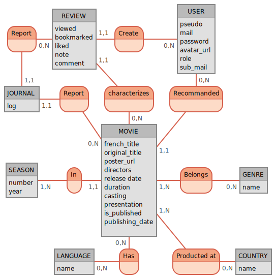

# [Mocodo](http://mocodo.wingi.net/)

```mocodo
Report, 0N REVIEW, 11 JOURNAL
REVIEW : _viewed, bookmarked, liked, note, comment
Create, 0N USER, 11 REVIEW
USER : _pseudo, mail, password, avatar_url, role, sub_mail
:

JOURNAL : _log
Report2, 0N MOVIE, 11 JOURNAL
characterizes, 11 REVIEW, 0N MOVIE
Recommanded, 0N USER, 11 MOVIE
:

SEASON : _number, year
In, 1N SEASON, 11 MOVIE
MOVIE : _french_title, original_title, poster_url, directors, release date, duration, casting, presentation, is_published, publishing_date,
Belongs, 0N GENRE, 1N MOVIE
GENRE : _name

:
LANGUAGE: _name
Has, 0N MOVIE, 0N LANGUAGE
Producted at, 0N COUNTRY, 1N MOVIE
COUNTRY: _name
```

<details>

</details>

# MLD

user (**id**, pseudo, mail, password, avatar_url, role, mail_sub, created_at, updated_at)  

movie (**id**, french_title, original_title, poster_url, directors, release_date, duration, casting, presentation, is_published, publishing_date, *#user_id*, *#season_id*, created_at, updated_at)  

season (**id**, number, year, created_at, updated_at)  

country (**id**, name, created_at, updated_at)  

movie_has_country (*#movie_id*, *#country_id*, created_at, updated_at)  

language (**id**, name, created_at, updated_at)  

movie_has_language (*#movie_id*, *#language_id*, created_at, updated_at)  

genre (**id**, name, created_at, updated_at)  

movie_has_genre (*#movie_id*, *#genre_id*, created_at, updated_at)  

review (viewed, bookmarked, liked, note, comment, *#movie_id*, *#user_id*, created_at, updated_at)  

journal (**id**, log, *#review_id*, *#movie_id* created_at, updated_at)

## Présentation visuelle (MPD)

